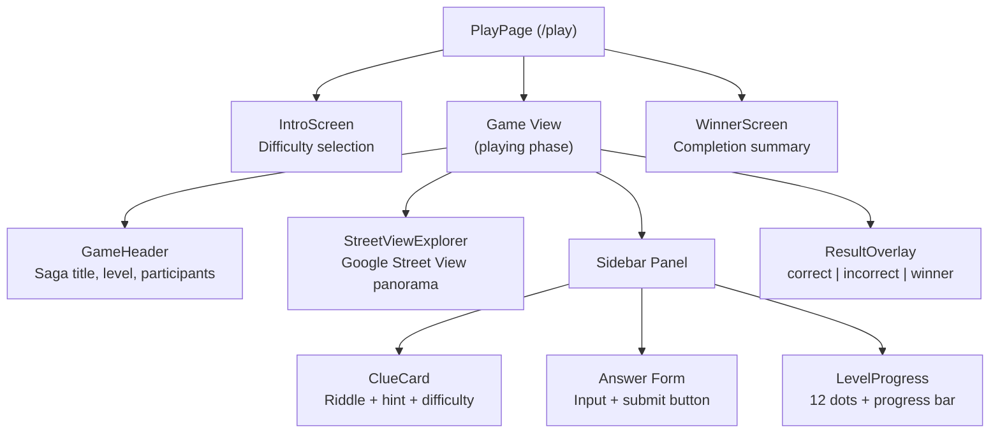
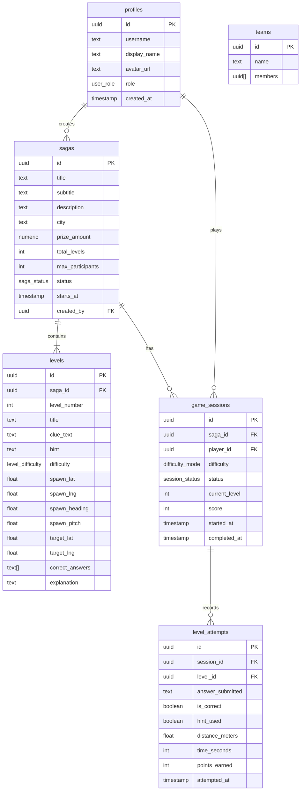
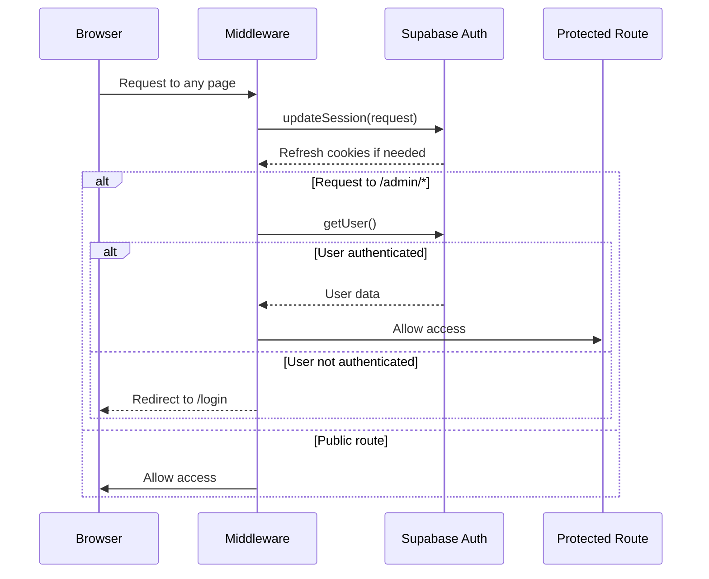
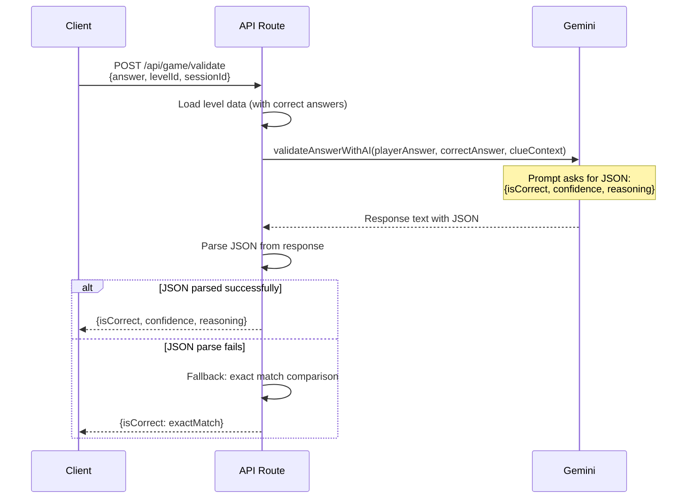

# Architecture — UBEX

> Technical architecture documentation for UBEX, the geo-exploration treasure hunt platform.

---

## Table of Contents

1. [System Overview](#system-overview)
2. [Frontend Architecture](#frontend-architecture)
3. [Backend Architecture](#backend-architecture)
4. [Database Schema](#database-schema)
5. [Authentication Flow](#authentication-flow)
6. [Real-Time Features](#real-time-features)
7. [Google Maps Integration](#google-maps-integration)
8. [AI Integration — Gemini](#ai-integration--gemini)
9. [State Management](#state-management)
10. [Security Considerations](#security-considerations)
11. [Deployment Architecture](#deployment-architecture)

---

## System Overview

```
┌─────────────────────────────────────────────────────────────────────────┐
│                              CLIENTS                                     │
│                                                                          │
│  ┌──────────────────────────────────────────────────────────────────┐   │
│  │                    Next.js 16 (App Router)                       │   │
│  │                                                                   │   │
│  │   Landing Page (/)          Game Page (/play)                    │   │
│  │   ┌──────────────┐         ┌──────────────────────────────┐     │   │
│  │   │ CountdownTimer│         │ StreetViewExplorer           │     │   │
│  │   │ Hero Section  │         │ ClueCard                     │     │   │
│  │   │ Mission Info  │         │ LevelProgress                │     │   │
│  │   └──────────────┘         │ GameHeader                   │     │   │
│  │                             │ ResultOverlay                │     │   │
│  │                             └──────────────────────────────┘     │   │
│  └──────────────────────────────────────────────────────────────────┘   │
│                          │              │             │                   │
└──────────────────────────┼──────────────┼─────────────┼──────────────────┘
                           │              │             │
                    ┌──────┘              │             └──────┐
                    ▼                     ▼                    ▼
           ┌──────────────┐     ┌──────────────┐     ┌──────────────┐
           │   Supabase   │     │ Google Maps  │     │   Gemini AI  │
           │              │     │   Platform   │     │              │
           │ • PostgreSQL │     │              │     │ • Answer     │
           │ • Auth       │     │ • Street View│     │   validation │
           │ • Realtime   │     │   API        │     │ • Saga       │
           │ • RLS        │     │ • Panorama   │     │   generation │
           │              │     │   Service    │     │ • Riddle     │
           └──────────────┘     └──────────────┘     │   creation   │
                                                      └──────────────┘
```

### Technology Stack

| Layer | Technology | Version | Purpose |
|-------|-----------|---------|---------|
| **Framework** | Next.js | 16.2.1 | App Router, SSR, API routes |
| **UI Library** | React | 19.2.4 | Component rendering |
| **Language** | TypeScript | 5.x | Type safety |
| **Styling** | Tailwind CSS | 4.x | Utility-first CSS (via PostCSS) |
| **Icons** | Phosphor Icons | Latest | `@phosphor-icons/react` |
| **State** | Zustand | Latest | Client-side game state |
| **Database** | Supabase (PostgreSQL) | Latest | Data persistence, auth, realtime |
| **Maps** | Google Maps JS API | weekly | Street View, panorama service |
| **Maps Loader** | @googlemaps/js-api-loader | 2.x | Lazy API loading |
| **AI** | Google Gemini | gemini-pro | Answer validation, saga generation |
| **Payments** | PayPal | Latest | `@paypal/react-paypal-js` |
| **3D** | Three.js / R3F | Latest | Globe visualization (planned) |
| **Hosting** | Vercel | — | Serverless deployment |

---

## Frontend Architecture

### App Router Structure

```
src/
├── app/
│   ├── layout.tsx          ← Root layout (fonts, metadata, theme)
│   ├── page.tsx            ← Landing page (/)
│   ├── play/
│   │   └── page.tsx        ← Game page (/play)
│   ├── globals.css         ← Tailwind imports + custom utilities
│   └── favicon.ico
├── components/
│   ├── game/
│   │   ├── AnswerInput.tsx        ← Standalone answer field (unused in demo)
│   │   ├── ClueCard.tsx           ← Riddle display + hint toggle
│   │   ├── CountdownTimer.tsx     ← Countdown to saga start
│   │   ├── GameHeader.tsx         ← Top bar (saga, level, participants)
│   │   ├── LevelProgress.tsx      ← Level dots + progress bar
│   │   ├── ParticipantTracker.tsx ← Survival rate display (unused in demo)
│   │   └── ResultOverlay.tsx      ← Success/fail/winner modals
│   └── maps/
│       └── StreetViewExplorer.tsx ← Google Street View integration
├── data/
│   └── demo-saga.ts        ← Static demo saga + 12 levels
├── hooks/
│   ├── index.ts
│   └── useCountdown.ts     ← Countdown timer hook
├── lib/
│   ├── firebase/            ← Firebase client scaffolding
│   ├── gemini/              ← Gemini AI client
│   ├── store/               ← Zustand game store
│   └── supabase/            ← Supabase client/server/middleware
├── types/
│   ├── index.ts             ← Domain types (Saga, Level, GameSession, etc.)
│   └── database.ts          ← Supabase generated types (scaffold)
└── middleware.ts             ← Auth session refresh + /admin protection
```

### Component Tree (Game Page)



### Root Layout

The root layout (`src/app/layout.tsx`) sets up:

- **Fonts**: Outfit (sans-serif, `--font-sans`) and JetBrains Mono (monospace, `--font-mono`)
- **Language**: `<html lang="es">` — Spanish as primary language
- **Theme**: Dark theme via `zinc-950` background with antialiased text
- **Metadata**: Title "UBEX — Arqueología Digital" with SEO keywords

### Styling Architecture

UBEX uses **Tailwind CSS v4** configured through PostCSS (no `tailwind.config` file):

```
postcss.config.mjs
  └── @tailwindcss/postcss plugin

src/app/globals.css
  └── @import "tailwindcss"
  └── Custom utility classes:
      ├── .transition-smooth    (200ms ease-out)
      ├── .fade-in, .fade-in-d1..d4  (staggered entry animations)
      ├── .compass-rotate       (360° rotation)
      ├── .float                (up/down floating)
      ├── .globe-pulse          (scale pulse)
      ├── .card-hover           (lift on hover)
      ├── .btn-press            (press feedback)
      ├── .section-inner        (max-w-7xl centered)
      └── .section-narrow       (max-w-3xl centered)
```

---

## Backend Architecture

### Current State (Demo)

The demo runs **entirely client-side**. All game logic, answer validation, and state management happen in the browser. This is intentional for the MVP/demo phase.

### Planned Architecture (Production)

```
┌──────────────────────────────────────────────────────────────┐
│                    Vercel Edge Network                         │
│                                                               │
│   ┌─────────────────┐    ┌──────────────────────────────┐   │
│   │  Next.js SSR    │    │  API Routes (Serverless)     │   │
│   │  • Landing page │    │                               │   │
│   │  • Game page    │    │  POST /api/game/start-session │   │
│   │  • Admin panel  │    │  POST /api/game/validate      │   │
│   │                 │    │  GET  /api/sagas              │   │
│   │                 │    │  GET  /api/leaderboard        │   │
│   │                 │    │  POST /api/admin/sagas        │   │
│   │                 │    │  POST /api/ai/generate-saga   │   │
│   └─────────────────┘    └──────────┬───────────────────┘   │
│                                      │                        │
└──────────────────────────────────────┼────────────────────────┘
                                       │
                            ┌──────────┴──────────┐
                            ▼                     ▼
                   ┌──────────────┐      ┌──────────────┐
                   │   Supabase   │      │  Gemini AI   │
                   │              │      │  (server-    │
                   │  PostgreSQL  │      │   side only) │
                   │  Auth        │      │              │
                   │  Realtime    │      │  • Validate  │
                   │  Storage     │      │    answers   │
                   │  RLS         │      │  • Generate  │
                   │              │      │    sagas     │
                   └──────────────┘      └──────────────┘
```

### API Route Design Principles

1. **Answer validation is server-side** — correct answers are never sent to the client
2. **Saga data is filtered** — `GET /api/sagas/[id]` strips `correctAnswers`, `targetLat`, `targetLng` from the response
3. **AI calls are server-side only** — `GEMINI_API_KEY` is a server-only env variable (no `NEXT_PUBLIC_` prefix)
4. **Admin routes are protected** — middleware redirects unauthenticated users from `/admin` to `/login`

---

## Database Schema

The database schema is defined in `src/types/database.ts` (Supabase-generated type scaffold). The planned tables are:

### Entity Relationship Diagram



### Leaderboard View

A database view (`leaderboard`) aggregates session data for ranking:

```sql
-- Planned leaderboard view
CREATE VIEW leaderboard AS
SELECT
    gs.saga_id,
    gs.player_id,
    p.username,
    p.display_name,
    gs.current_level,
    gs.score,
    gs.completed_at,
    gs.started_at,
    EXTRACT(EPOCH FROM (gs.completed_at - gs.started_at)) as total_seconds
FROM game_sessions gs
JOIN profiles p ON p.id = gs.player_id
WHERE gs.status = 'completed'
ORDER BY gs.completed_at ASC, gs.score DESC;
```

### Database Enums

| Enum | Values |
|------|--------|
| `user_role` | `player`, `creator`, `admin` |
| `saga_status` | `draft`, `scheduled`, `active`, `completed` |
| `difficulty_mode` | `libre`, `explorador` |
| `session_status` | `waiting`, `countdown`, `playing`, `completed` |
| `level_difficulty` | `easy`, `medium`, `hard`, `extreme` |

---

## Authentication Flow

UBEX uses **Supabase Auth** for authentication, with Next.js middleware for session management.

### Flow Diagram



### Implementation Details

**Middleware** (`src/middleware.ts`):
- Runs on every request (excluding static assets, images, favicon)
- Delegates to `updateSession()` from `src/lib/supabase/middleware.ts`
- Protects `/admin` routes — redirects unauthenticated users to `/login`

**Browser Client** (`src/lib/supabase/client.ts`):
- Singleton pattern via `getSupabaseBrowser()`
- Uses `createBrowserClient<Database>()` from `@supabase/ssr`
- Reads `NEXT_PUBLIC_SUPABASE_URL` and `NEXT_PUBLIC_SUPABASE_ANON_KEY`

**Server Client** (`src/lib/supabase/server.ts`):
- Async function `getSupabaseServer()`
- Uses `cookies()` from `next/headers` for cookie-based auth
- Handles cookie set errors gracefully when called from Server Components

---

## Real-Time Features

### Supabase Realtime (Planned)

UBEX will use Supabase Realtime for live game features:

```
┌─────────────────────────────────────────────────────┐
│                Supabase Realtime                     │
│                                                      │
│  Channel: saga:{saga_id}                            │
│  ┌───────────────────────────────────────────────┐  │
│  │ Events:                                        │  │
│  │  • player_joined   → Update participant count  │  │
│  │  • level_completed → Update leaderboard        │  │
│  │  • player_won      → Show winner notification  │  │
│  │  • game_started    → Trigger countdown → play  │  │
│  └───────────────────────────────────────────────┘  │
└─────────────────────────────────────────────────────┘
```

### LiveGameEvent Type

Defined in `src/types/index.ts`:

```typescript
interface LiveGameEvent {
  type: 'player_joined' | 'level_completed' | 'player_finished';
  sagaId: string;
  playerId: string;
  playerName: string;
  levelNumber?: number;
  timestamp: string;
}
```

### Demo: Simulated Participants

In the current demo, participant counts are simulated client-side:

```
Base: 4,832 participants
Per level drop: ~380 participants
Jitter: ±50 random variation
Update interval: every 3 seconds
Floor: minimum 200 (display), minimum 100 (jitter)
```

---

## Google Maps Integration

### Street View Architecture

The `StreetViewExplorer` component (`src/components/maps/StreetViewExplorer.tsx`) manages all Google Maps interactions.

### API Loading Strategy

```
┌──────────────────────────────────────────────────────────┐
│                  API Loading (Singleton)                   │
│                                                           │
│  Module-level variables:                                  │
│    initialized: boolean = false                           │
│    loadPromise: Promise | null = null                     │
│                                                           │
│  First mount:                                             │
│    1. Create Loader({ apiKey, version: "weekly" })        │
│    2. importLibrary("streetView")                         │
│    3. importLibrary("maps")                               │
│    4. Set initialized = true                              │
│                                                           │
│  Subsequent mounts:                                       │
│    → Reuse loadPromise (no duplicate API loads)           │
└──────────────────────────────────────────────────────────┘
```

### Panorama Finding

When a level loads, the component searches for the nearest Street View panorama:

```typescript
const service = new google.maps.StreetViewService();

const response = await service.getPanorama({
  location: { lat, lng },  // Level's spawn coordinates
  radius: 200,             // Search within 200 meters
  preference: google.maps.StreetViewPreference.NEAREST,
  source: google.maps.StreetViewSource.OUTDOOR,
});
```

**Key parameters**:

| Parameter | Value | Why |
|-----------|-------|-----|
| `radius` | `200` meters | Wide enough to find coverage, narrow enough to stay near the target |
| `preference` | `NEAREST` | Get the closest panorama to spawn point |
| `source` | `OUTDOOR` | Exclude indoor panoramas (museums, shops) |

### Position Tracking

The component listens for player movement and reports coordinates:

```
Player drags/clicks in Street View
        │
        ▼
position_changed event fires
        │
        ▼
Extract panorama.getPosition()
        │
        ▼
Call onPositionChange({ lat, lng })
        │
        ▼
Play page stores in playerPos state
        │
        ▼
Used for Haversine distance calculation
(mode explorador only)
```

### Component States

| State | Meaning | Display |
|-------|---------|---------|
| `loading` | API or panorama loading | Spinner + "Cargando Street View..." |
| `ready` | Panorama rendered, interactive | Full Street View |
| `error` | API key missing or load failure | Error message |
| `no-coverage` | No panorama found within 200m | "Sin cobertura" message |

### Environment Variable

```
NEXT_PUBLIC_GOOGLE_MAPS_API_KEY=your_api_key_here
```

This is the **only** Maps-related env variable. It's `NEXT_PUBLIC_` because the Google Maps JS API loads client-side.

---

## AI Integration — Gemini

### Client Setup

Defined in `src/lib/gemini/client.ts`. Uses `@google/generative-ai` package with model `gemini-pro`.

```
Environment variable: GEMINI_API_KEY (server-side only — no NEXT_PUBLIC_ prefix)
```

### Answer Validation with AI



**Prompt structure** (answer validation):

```
Given this riddle: "{clueContext}"
The correct answer is: "{correctAnswer}"
The player answered: "{playerAnswer}"

Determine if the player's answer is correct. Consider:
- Synonyms and alternate phrasings
- Minor spelling mistakes
- Partial but essentially correct answers

Return JSON: { isCorrect: boolean, confidence: number, reasoning: string }
```

### Saga Generation with AI

```
generateRiddle(locationDescription, difficulty)
        │
        ▼
    Prompt Gemini to create:
    {
      clue: string,      // The riddle text
      answer: string,     // The correct answer
      hint: string,       // Optional hint
      difficulty: string  // Matches requested difficulty
    }
        │
        ▼
    Parse JSON response
        │
        ▼
    Return structured riddle data
```

### Current Status

> **Important**: The demo page (`/play`) does **not** call Gemini. It uses local fuzzy matching against `DEMO_LEVELS[].correctAnswers[]`. Gemini integration is scaffolded and ready for production use via API routes.

---

## State Management

### Zustand Game Store

Defined in `src/lib/store/game-store.ts`:

```typescript
interface GameStore {
  // State
  session: GameSession | null;
  progress: PlayerProgress | null;
  countdownSeconds: number;
  liveParticipantCount: number;
  isSubmitting: boolean;

  // Actions
  setSession: (session: GameSession | null) => void;
  setProgress: (progress: PlayerProgress | null) => void;
  setCountdownSeconds: (seconds: number) => void;
  setLiveParticipantCount: (count: number) => void;
  setIsSubmitting: (submitting: boolean) => void;
  reset: () => void;
}
```

### Demo State (Play Page)

The current demo uses local React state instead of the Zustand store:

| State Variable | Type | Purpose |
|---------------|------|---------|
| `phase` | `'intro' \| 'playing' \| 'completed'` | Current game phase |
| `difficulty` | `'libre' \| 'explorador'` | Chosen difficulty mode |
| `levelIndex` | `number` | Current level (0-indexed) |
| `completedLevels` | `Set<number>` | Completed level indices |
| `answer` | `string` | Current answer input |
| `feedback` | `object \| null` | `{ type, message }` for correct/incorrect/too-far |
| `submitting` | `boolean` | Loading state during validation |
| `shakeInput` | `boolean` | Trigger input shake animation |
| `playerPos` | `{ lat, lng } \| null` | Player's current Street View position |
| `startTime` | `number \| null` | `Date.now()` when saga started |
| `sidebarOpen` | `boolean` | Mobile sidebar visibility |

---

## Security Considerations

### Answer Protection

| Concern | Current (Demo) | Planned (Production) |
|---------|----------------|---------------------|
| **Answer storage** | Client-side in `demo-saga.ts` | Server-side only (Supabase, never sent to client) |
| **Answer validation** | Client-side fuzzy match | Server-side via API route + optional Gemini |
| **Target coordinates** | Client-side in demo data | Stripped from client responses; server-side proximity validation |
| **Score calculation** | Not yet implemented | Server-side only |

### Supabase Row Level Security (RLS)

Planned RLS policies:

```sql
-- Players can only read their own sessions
CREATE POLICY "Players read own sessions"
ON game_sessions FOR SELECT
USING (auth.uid() = player_id);

-- Players can only read saga data (not answers)
CREATE POLICY "Public saga read"
ON sagas FOR SELECT
USING (status IN ('scheduled', 'active', 'completed'));

-- Only admins can create/modify sagas
CREATE POLICY "Admin saga management"
ON sagas FOR ALL
USING (
  EXISTS (
    SELECT 1 FROM profiles
    WHERE profiles.id = auth.uid()
    AND profiles.role = 'admin'
  )
);

-- Level data: correct_answers only accessible server-side
-- (filtered out in API response, RLS allows read for server role)
```

### API Key Security

| Key | Exposure | Rationale |
|-----|----------|-----------|
| `NEXT_PUBLIC_GOOGLE_MAPS_API_KEY` | Client-side | Required for Maps JS API; restricted by HTTP referrer in Google Cloud Console |
| `NEXT_PUBLIC_SUPABASE_URL` | Client-side | Safe with RLS enabled; Supabase designed for this |
| `NEXT_PUBLIC_SUPABASE_ANON_KEY` | Client-side | Limited by RLS policies; no direct DB access |
| `GEMINI_API_KEY` | Server-side only | Never exposed to client; used in API routes only |
| `PAYPAL_CLIENT_SECRET` | Server-side only | Payment processing; never in browser |
| `NEXT_PUBLIC_FIREBASE_*` | Client-side | Firebase config is safe to expose; security via Firebase Rules |

### Middleware Protection

```typescript
// src/lib/supabase/middleware.ts
// Protects /admin routes
if (request.nextUrl.pathname.startsWith('/admin')) {
  const { data: { user } } = await supabase.auth.getUser();
  if (!user) {
    return NextResponse.redirect(new URL('/login', request.url));
  }
}
```

---

## Deployment Architecture

### Current Deployment

```
┌──────────────┐     ┌──────────────────┐     ┌──────────────┐
│   GitHub     │────▶│ GitHub Actions   │────▶│ GitHub Pages │
│   Repository │     │ (deploy.yml)     │     │ (static)     │
│              │     │                   │     │              │
│   main       │     │ next build       │     │ ./out/       │
│   branch     │     │ (static export)  │     │              │
└──────────────┘     └──────────────────┘     └──────────────┘
```

**Current CI/CD** (`.github/workflows/deploy.yml`):
- Triggers on push to `main`
- Runs `next build` with `output: 'export'` (static HTML)
- Deploys `./out/` directory to GitHub Pages
- Passes `NEXT_PUBLIC_GOOGLE_MAPS_API_KEY` as build-time env variable

### Planned Production Deployment

```
┌──────────────┐     ┌──────────────────┐     ┌──────────────┐
│   GitHub     │────▶│  Vercel          │────▶│  CDN Edge    │
│   Repository │     │                   │     │              │
│              │     │  • SSR pages     │     │  • Static    │
│   main →     │     │  • API routes    │     │  • Images    │
│   production │     │  • Middleware     │     │  • Fonts     │
│              │     │  • Env vars      │     │              │
│   develop →  │     │                   │     │              │
│   preview    │     │  Serverless      │     │              │
│              │     │  Functions       │     │              │
└──────────────┘     └──────────────────┘     └──────────────┘
                              │
                    ┌─────────┴─────────┐
                    ▼                   ▼
           ┌──────────────┐    ┌──────────────┐
           │   Supabase   │    │  Google      │
           │   Cloud      │    │  Cloud       │
           │              │    │              │
           │  PostgreSQL  │    │  Maps API    │
           │  Auth        │    │  Gemini API  │
           │  Realtime    │    │              │
           │  Storage     │    │              │
           └──────────────┘    └──────────────┘
```

### Configuration Files

| File | Purpose |
|------|---------|
| `next.config.ts` | `images.unoptimized = true` (for static export compatibility) |
| `tsconfig.json` | Strict mode, bundler module resolution, `@/*` → `./src/*` path alias |
| `postcss.config.mjs` | `@tailwindcss/postcss` plugin (Tailwind v4) |
| `eslint.config.mjs` | Next.js core-web-vitals + TypeScript rules |
| `.github/workflows/deploy.yml` | CI/CD: build + deploy to GitHub Pages |

### Environment Variables Summary

| Variable | Context | Required |
|----------|---------|----------|
| `NEXT_PUBLIC_GOOGLE_MAPS_API_KEY` | Client + Build | Yes (for Street View) |
| `NEXT_PUBLIC_SUPABASE_URL` | Client | Yes (production) |
| `NEXT_PUBLIC_SUPABASE_ANON_KEY` | Client | Yes (production) |
| `GEMINI_API_KEY` | Server only | Yes (for AI features) |
| `NEXT_PUBLIC_FIREBASE_API_KEY` | Client | Optional (Firebase features) |
| `NEXT_PUBLIC_FIREBASE_AUTH_DOMAIN` | Client | Optional |
| `NEXT_PUBLIC_FIREBASE_PROJECT_ID` | Client | Optional |
| `NEXT_PUBLIC_FIREBASE_STORAGE_BUCKET` | Client | Optional |
| `NEXT_PUBLIC_FIREBASE_MESSAGING_SENDER_ID` | Client | Optional |
| `NEXT_PUBLIC_FIREBASE_APP_ID` | Client | Optional |
| `NEXT_PUBLIC_FIREBASE_DATABASE_URL` | Client | Optional |
| `NEXT_PUBLIC_PAYPAL_CLIENT_ID` | Client | Optional (payments) |
| `PAYPAL_CLIENT_SECRET` | Server only | Optional (payments) |
| `NEXT_PUBLIC_GOOGLE_PAY_MERCHANT_ID` | Client | Optional (payments) |
| `NEXT_PUBLIC_APP_URL` | Client | Optional (defaults to `http://localhost:3000`) |
