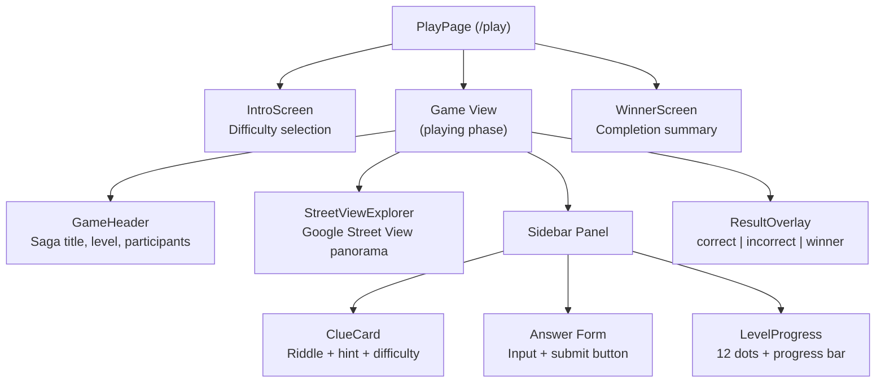
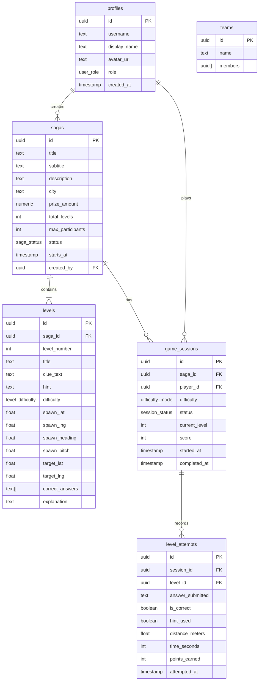
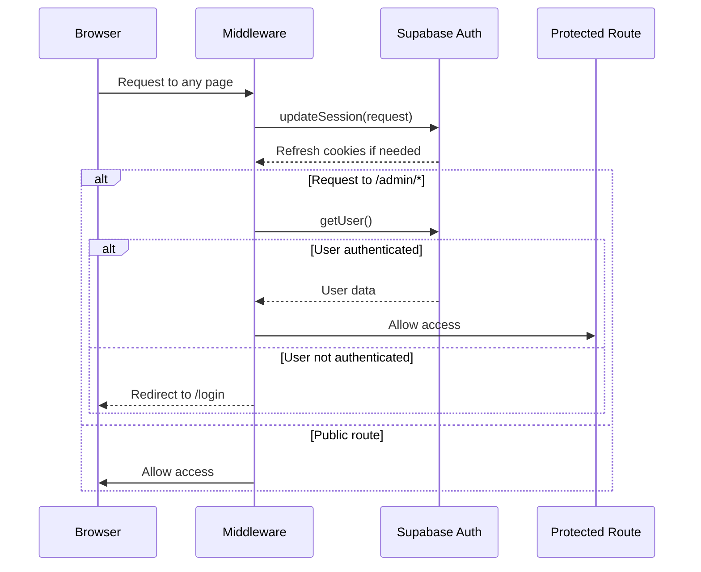
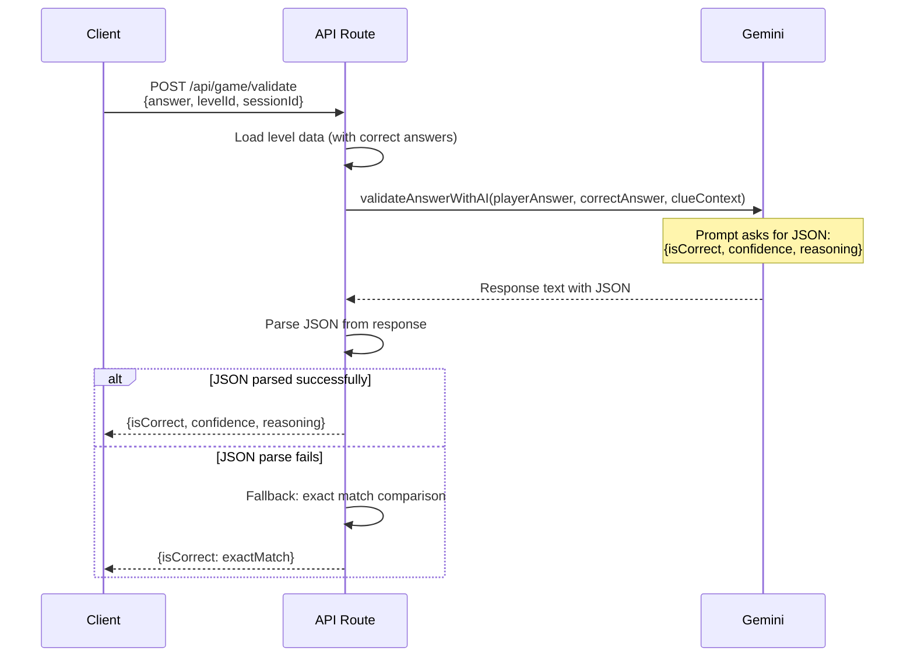

# Arquitectura — UBEX

> Documentación de arquitectura técnica para UBEX, la plataforma de búsqueda de tesoros y geo-exploración.

---

## Tabla de Contenidos

1. [Visión General del Sistema](#visión-general-del-sistema)
2. [Arquitectura del Frontend](#arquitectura-del-frontend)
3. [Arquitectura del Backend](#arquitectura-del-backend)
4. [Esquema de Base de Datos](#esquema-de-base-de-datos)
5. [Flujo de Autenticación](#flujo-de-autenticación)
6. [Funcionalidades en Tiempo Real](#funcionalidades-en-tiempo-real)
7. [Integración con Google Maps](#integración-con-google-maps)
8. [Integración con IA — Gemini](#integración-con-ia--gemini)
9. [Gestión de Estado](#gestión-de-estado)
10. [Consideraciones de Seguridad](#consideraciones-de-seguridad)
11. [Arquitectura de Despliegue](#arquitectura-de-despliegue)

---

## Visión General del Sistema

```
┌─────────────────────────────────────────────────────────────────────────┐
│                              CLIENTS                                     │
│                                                                          │
│  ┌──────────────────────────────────────────────────────────────────┐   │
│  │                    Next.js 16 (App Router)                       │   │
│  │                                                                   │   │
│  │   Landing Page (/)          Game Page (/play)                    │   │
│  │   ┌──────────────┐         ┌──────────────────────────────┐     │   │
│  │   │ CountdownTimer│         │ StreetViewExplorer           │     │   │
│  │   │ Hero Section  │         │ ClueCard                     │     │   │
│  │   │ Mission Info  │         │ LevelProgress                │     │   │
│  │   └──────────────┘         │ GameHeader                   │     │   │
│  │                             │ ResultOverlay                │     │   │
│  │                             └──────────────────────────────┘     │   │
│  └──────────────────────────────────────────────────────────────────┘   │
│                          │              │             │                   │
└──────────────────────────┼──────────────┼─────────────┼──────────────────┘
                           │              │             │
                    ┌──────┘              │             └──────┐
                    ▼                     ▼                    ▼
           ┌──────────────┐     ┌──────────────┐     ┌──────────────┐
           │   Supabase   │     │ Google Maps  │     │   Gemini AI  │
           │              │     │   Platform   │     │              │
           │ • PostgreSQL │     │              │     │ • Answer     │
           │ • Auth       │     │ • Street View│     │   validation │
           │ • Realtime   │     │   API        │     │ • Saga       │
           │ • RLS        │     │ • Panorama   │     │   generation │
           │              │     │   Service    │     │ • Riddle     │
           └──────────────┘     └──────────────┘     │   creation   │
                                                      └──────────────┘
```

### Stack Tecnológico

| Capa | Tecnología | Versión | Propósito |
|------|-----------|---------|-----------|
| **Framework** | Next.js | 16.2.1 | App Router, SSR, API routes |
| **Librería UI** | React | 19.2.4 | Renderizado de componentes |
| **Lenguaje** | TypeScript | 5.x | Seguridad de tipos |
| **Estilos** | Tailwind CSS | 4.x | CSS utility-first (vía PostCSS) |
| **Íconos** | Phosphor Icons | Latest | `@phosphor-icons/react` |
| **Estado** | Zustand | Latest | Estado del juego en el cliente |
| **Base de Datos** | Supabase (PostgreSQL) | Latest | Persistencia de datos, auth, realtime |
| **Mapas** | Google Maps JS API | weekly | Street View, servicio de panorama |
| **Cargador de Mapas** | @googlemaps/js-api-loader | 2.x | Carga diferida de la API |
| **IA** | Google Gemini | gemini-pro | Validación de respuestas, generación de sagas |
| **Pagos** | PayPal | Latest | `@paypal/react-paypal-js` |
| **3D** | Three.js / R3F | Latest | Visualización de globo (planificado) |
| **Hosting** | Vercel | — | Despliegue serverless |

---

## Arquitectura del Frontend

### Estructura del App Router

```
src/
├── app/
│   ├── layout.tsx          ← Root layout (fonts, metadata, theme)
│   ├── page.tsx            ← Landing page (/)
│   ├── play/
│   │   └── page.tsx        ← Game page (/play)
│   ├── globals.css         ← Tailwind imports + custom utilities
│   └── favicon.ico
├── components/
│   ├── game/
│   │   ├── AnswerInput.tsx        ← Standalone answer field (unused in demo)
│   │   ├── ClueCard.tsx           ← Riddle display + hint toggle
│   │   ├── CountdownTimer.tsx     ← Countdown to saga start
│   │   ├── GameHeader.tsx         ← Top bar (saga, level, participants)
│   │   ├── LevelProgress.tsx      ← Level dots + progress bar
│   │   ├── ParticipantTracker.tsx ← Survival rate display (unused in demo)
│   │   └── ResultOverlay.tsx      ← Success/fail/winner modals
│   └── maps/
│       └── StreetViewExplorer.tsx ← Google Street View integration
├── data/
│   └── demo-saga.ts        ← Static demo saga + 12 levels
├── hooks/
│   ├── index.ts
│   └── useCountdown.ts     ← Countdown timer hook
├── lib/
│   ├── firebase/            ← Firebase client scaffolding
│   ├── gemini/              ← Gemini AI client
│   ├── store/               ← Zustand game store
│   └── supabase/            ← Supabase client/server/middleware
├── types/
│   ├── index.ts             ← Domain types (Saga, Level, GameSession, etc.)
│   └── database.ts          ← Supabase generated types (scaffold)
└── middleware.ts             ← Auth session refresh + /admin protection
```

### Árbol de Componentes (Página de Juego)



### Layout Raíz

El layout raíz (`src/app/layout.tsx`) configura:

- **Fuentes**: Outfit (sans-serif, `--font-sans`) y JetBrains Mono (monospace, `--font-mono`)
- **Idioma**: `<html lang="es">` — español como idioma principal
- **Tema**: Tema oscuro mediante fondo `zinc-950` con texto suavizado (antialiased)
- **Metadatos**: Título "UBEX — Arqueología Digital" con palabras clave SEO

### Arquitectura de Estilos

UBEX utiliza **Tailwind CSS v4** configurado a través de PostCSS (sin archivo `tailwind.config`):

```
postcss.config.mjs
  └── @tailwindcss/postcss plugin

src/app/globals.css
  └── @import "tailwindcss"
  └── Custom utility classes:
      ├── .transition-smooth    (200ms ease-out)
      ├── .fade-in, .fade-in-d1..d4  (staggered entry animations)
      ├── .compass-rotate       (360° rotation)
      ├── .float                (up/down floating)
      ├── .globe-pulse          (scale pulse)
      ├── .card-hover           (lift on hover)
      ├── .btn-press            (press feedback)
      ├── .section-inner        (max-w-7xl centered)
      └── .section-narrow       (max-w-3xl centered)
```

---

## Arquitectura del Backend

### Estado Actual (Demo)

El demo se ejecuta **completamente en el cliente**. Toda la lógica del juego, la validación de respuestas y la gestión de estado ocurren en el navegador. Esto es intencional para la fase de MVP/demo.

### Arquitectura Planificada (Producción)

```
┌──────────────────────────────────────────────────────────────┐
│                    Vercel Edge Network                         │
│                                                               │
│   ┌─────────────────┐    ┌──────────────────────────────┐   │
│   │  Next.js SSR    │    │  API Routes (Serverless)     │   │
│   │  • Landing page │    │                               │   │
│   │  • Game page    │    │  POST /api/game/start-session │   │
│   │  • Admin panel  │    │  POST /api/game/validate      │   │
│   │                 │    │  GET  /api/sagas              │   │
│   │                 │    │  GET  /api/leaderboard        │   │
│   │                 │    │  POST /api/admin/sagas        │   │
│   │                 │    │  POST /api/ai/generate-saga   │   │
│   └─────────────────┘    └──────────┬───────────────────┘   │
│                                      │                        │
└──────────────────────────────────────┼────────────────────────┘
                                       │
                            ┌──────────┴──────────┐
                            ▼                     ▼
                   ┌──────────────┐      ┌──────────────┐
                   │   Supabase   │      │  Gemini AI   │
                   │              │      │  (server-    │
                   │  PostgreSQL  │      │   side only) │
                   │  Auth        │      │              │
                   │  Realtime    │      │  • Validate  │
                   │  Storage     │      │    answers   │
                   │  RLS         │      │  • Generate  │
                   │              │      │    sagas     │
                   └──────────────┘      └──────────────┘
```

### Principios de Diseño de API Routes

1. **La validación de respuestas es server-side** — las respuestas correctas nunca se envían al cliente
2. **Los datos de sagas se filtran** — `GET /api/sagas/[id]` elimina `correctAnswers`, `targetLat`, `targetLng` de la respuesta
3. **Las llamadas a IA son server-side únicamente** — `GEMINI_API_KEY` es una variable de entorno solo del servidor (sin prefijo `NEXT_PUBLIC_`)
4. **Las rutas de admin están protegidas** — el middleware redirige a usuarios no autenticados de `/admin` a `/login`

---

## Esquema de Base de Datos

El esquema de base de datos está definido en `src/types/database.ts` (scaffold de tipos generado por Supabase). Las tablas planificadas son:

### Diagrama de Entidad-Relación



### Vista de Tabla de Posiciones

Una vista de base de datos (`leaderboard`) agrega datos de sesión para el ranking:

```sql
-- Planned leaderboard view
CREATE VIEW leaderboard AS
SELECT
    gs.saga_id,
    gs.player_id,
    p.username,
    p.display_name,
    gs.current_level,
    gs.score,
    gs.completed_at,
    gs.started_at,
    EXTRACT(EPOCH FROM (gs.completed_at - gs.started_at)) as total_seconds
FROM game_sessions gs
JOIN profiles p ON p.id = gs.player_id
WHERE gs.status = 'completed'
ORDER BY gs.completed_at ASC, gs.score DESC;
```

### Enums de Base de Datos

| Enum | Valores |
|------|---------|
| `user_role` | `player`, `creator`, `admin` |
| `saga_status` | `draft`, `scheduled`, `active`, `completed` |
| `difficulty_mode` | `libre`, `explorador` |
| `session_status` | `waiting`, `countdown`, `playing`, `completed` |
| `level_difficulty` | `easy`, `medium`, `hard`, `extreme` |

---

## Flujo de Autenticación

UBEX utiliza **Supabase Auth** para la autenticación, con middleware de Next.js para la gestión de sesiones.

### Diagrama de Flujo



### Detalles de Implementación

**Middleware** (`src/middleware.ts`):
- Se ejecuta en cada solicitud (excluyendo activos estáticos, imágenes, favicon)
- Delega a `updateSession()` de `src/lib/supabase/middleware.ts`
- Protege las rutas `/admin` — redirige a usuarios no autenticados a `/login`

**Cliente del Navegador** (`src/lib/supabase/client.ts`):
- Patrón singleton mediante `getSupabaseBrowser()`
- Usa `createBrowserClient<Database>()` de `@supabase/ssr`
- Lee `NEXT_PUBLIC_SUPABASE_URL` y `NEXT_PUBLIC_SUPABASE_ANON_KEY`

**Cliente del Servidor** (`src/lib/supabase/server.ts`):
- Función asíncrona `getSupabaseServer()`
- Usa `cookies()` de `next/headers` para autenticación basada en cookies
- Maneja errores de configuración de cookies de forma elegante cuando se llama desde Server Components

---

## Funcionalidades en Tiempo Real

### Supabase Realtime (Planificado)

UBEX utilizará Supabase Realtime para funcionalidades de juego en vivo:

```
┌─────────────────────────────────────────────────────┐
│                Supabase Realtime                     │
│                                                      │
│  Channel: saga:{saga_id}                            │
│  ┌───────────────────────────────────────────────┐  │
│  │ Events:                                        │  │
│  │  • player_joined   → Update participant count  │  │
│  │  • level_completed → Update leaderboard        │  │
│  │  • player_won      → Show winner notification  │  │
│  │  • game_started    → Trigger countdown → play  │  │
│  └───────────────────────────────────────────────┘  │
└─────────────────────────────────────────────────────┘
```

### Tipo LiveGameEvent

Definido en `src/types/index.ts`:

```typescript
interface LiveGameEvent {
  type: 'player_joined' | 'level_completed' | 'player_finished';
  sagaId: string;
  playerId: string;
  playerName: string;
  levelNumber?: number;
  timestamp: string;
}
```

### Demo: Participantes Simulados

En el demo actual, los conteos de participantes se simulan en el cliente:

```
Base: 4,832 participants
Per level drop: ~380 participants
Jitter: ±50 random variation
Update interval: every 3 seconds
Floor: minimum 200 (display), minimum 100 (jitter)
```

---

## Integración con Google Maps

### Arquitectura de Street View

El componente `StreetViewExplorer` (`src/components/maps/StreetViewExplorer.tsx`) gestiona todas las interacciones con Google Maps.

### Estrategia de Carga de la API

```
┌──────────────────────────────────────────────────────────┐
│                  API Loading (Singleton)                   │
│                                                           │
│  Module-level variables:                                  │
│    initialized: boolean = false                           │
│    loadPromise: Promise | null = null                     │
│                                                           │
│  First mount:                                             │
│    1. Create Loader({ apiKey, version: "weekly" })        │
│    2. importLibrary("streetView")                         │
│    3. importLibrary("maps")                               │
│    4. Set initialized = true                              │
│                                                           │
│  Subsequent mounts:                                       │
│    → Reuse loadPromise (no duplicate API loads)           │
└──────────────────────────────────────────────────────────┘
```

### Búsqueda de Panorama

Cuando se carga un nivel, el componente busca el panorama de Street View más cercano:

```typescript
const service = new google.maps.StreetViewService();

const response = await service.getPanorama({
  location: { lat, lng },  // Level's spawn coordinates
  radius: 200,             // Search within 200 meters
  preference: google.maps.StreetViewPreference.NEAREST,
  source: google.maps.StreetViewSource.OUTDOOR,
});
```

**Parámetros clave**:

| Parámetro | Valor | Razón |
|-----------|-------|-------|
| `radius` | `200` metros | Suficientemente amplio para encontrar cobertura, suficientemente estrecho para mantenerse cerca del objetivo |
| `preference` | `NEAREST` | Obtener el panorama más cercano al punto de inicio |
| `source` | `OUTDOOR` | Excluir panoramas interiores (museos, tiendas) |

### Seguimiento de Posición

El componente escucha el movimiento del jugador y reporta coordenadas:

```
Player drags/clicks in Street View
        │
        ▼
position_changed event fires
        │
        ▼
Extract panorama.getPosition()
        │
        ▼
Call onPositionChange({ lat, lng })
        │
        ▼
Play page stores in playerPos state
        │
        ▼
Used for Haversine distance calculation
(mode explorador only)
```

### Estados del Componente

| Estado | Significado | Visualización |
|--------|-------------|---------------|
| `loading` | Cargando API o panorama | Spinner + "Cargando Street View..." |
| `ready` | Panorama renderizado, interactivo | Street View completo |
| `error` | API key faltante o error de carga | Mensaje de error |
| `no-coverage` | No se encontró panorama en 200m | Mensaje "Sin cobertura" |

### Variable de Entorno

```
NEXT_PUBLIC_GOOGLE_MAPS_API_KEY=your_api_key_here
```

Esta es la **única** variable de entorno relacionada con Maps. Lleva el prefijo `NEXT_PUBLIC_` porque la API de Google Maps JS se carga en el cliente.

---

## Integración con IA — Gemini

### Configuración del Cliente

Definido en `src/lib/gemini/client.ts`. Usa el paquete `@google/generative-ai` con el modelo `gemini-pro`.

```
Environment variable: GEMINI_API_KEY (server-side only — no NEXT_PUBLIC_ prefix)
```

### Validación de Respuestas con IA



**Estructura del prompt** (validación de respuestas):

```
Given this riddle: "{clueContext}"
The correct answer is: "{correctAnswer}"
The player answered: "{playerAnswer}"

Determine if the player's answer is correct. Consider:
- Synonyms and alternate phrasings
- Minor spelling mistakes
- Partial but essentially correct answers

Return JSON: { isCorrect: boolean, confidence: number, reasoning: string }
```

### Generación de Sagas con IA

```
generateRiddle(locationDescription, difficulty)
        │
        ▼
    Prompt Gemini to create:
    {
      clue: string,      // The riddle text
      answer: string,     // The correct answer
      hint: string,       // Optional hint
      difficulty: string  // Matches requested difficulty
    }
        │
        ▼
    Parse JSON response
        │
        ▼
    Return structured riddle data
```

### Estado Actual

> **Importante**: La página de demo (`/play`) **no** llama a Gemini. Utiliza coincidencia difusa local contra `DEMO_LEVELS[].correctAnswers[]`. La integración con Gemini está preparada (scaffold) y lista para uso en producción a través de API routes.

---

## Gestión de Estado

### Zustand Game Store

Definido en `src/lib/store/game-store.ts`:

```typescript
interface GameStore {
  // State
  session: GameSession | null;
  progress: PlayerProgress | null;
  countdownSeconds: number;
  liveParticipantCount: number;
  isSubmitting: boolean;

  // Actions
  setSession: (session: GameSession | null) => void;
  setProgress: (progress: PlayerProgress | null) => void;
  setCountdownSeconds: (seconds: number) => void;
  setLiveParticipantCount: (count: number) => void;
  setIsSubmitting: (submitting: boolean) => void;
  reset: () => void;
}
```

### Estado del Demo (Página de Juego)

El demo actual usa estado local de React en lugar del store de Zustand:

| Variable de Estado | Tipo | Propósito |
|-------------------|------|-----------|
| `phase` | `'intro' \| 'playing' \| 'completed'` | Fase actual del juego |
| `difficulty` | `'libre' \| 'explorador'` | Modo de dificultad elegido |
| `levelIndex` | `number` | Nivel actual (indexado desde 0) |
| `completedLevels` | `Set<number>` | Índices de niveles completados |
| `answer` | `string` | Entrada de respuesta actual |
| `feedback` | `object \| null` | `{ type, message }` para correcto/incorrecto/muy-lejos |
| `submitting` | `boolean` | Estado de carga durante validación |
| `shakeInput` | `boolean` | Activar animación de sacudida del input |
| `playerPos` | `{ lat, lng } \| null` | Posición actual del jugador en Street View |
| `startTime` | `number \| null` | `Date.now()` al iniciar la saga |
| `sidebarOpen` | `boolean` | Visibilidad del sidebar en móvil |

---

## Consideraciones de Seguridad

### Protección de Respuestas

| Aspecto | Actual (Demo) | Planificado (Producción) |
|---------|---------------|--------------------------|
| **Almacenamiento de respuestas** | En el cliente en `demo-saga.ts` | Solo server-side (Supabase, nunca se envía al cliente) |
| **Validación de respuestas** | Coincidencia difusa en el cliente | Server-side vía API route + Gemini opcional |
| **Coordenadas objetivo** | En el cliente en datos del demo | Se eliminan de las respuestas al cliente; validación de proximidad server-side |
| **Cálculo de puntaje** | Aún no implementado | Solo server-side |

### Supabase Row Level Security (RLS)

Políticas de RLS planificadas:

```sql
-- Players can only read their own sessions
CREATE POLICY "Players read own sessions"
ON game_sessions FOR SELECT
USING (auth.uid() = player_id);

-- Players can only read saga data (not answers)
CREATE POLICY "Public saga read"
ON sagas FOR SELECT
USING (status IN ('scheduled', 'active', 'completed'));

-- Only admins can create/modify sagas
CREATE POLICY "Admin saga management"
ON sagas FOR ALL
USING (
  EXISTS (
    SELECT 1 FROM profiles
    WHERE profiles.id = auth.uid()
    AND profiles.role = 'admin'
  )
);

-- Level data: correct_answers only accessible server-side
-- (filtered out in API response, RLS allows read for server role)
```

### Seguridad de API Keys

| Clave | Exposición | Justificación |
|-------|------------|---------------|
| `NEXT_PUBLIC_GOOGLE_MAPS_API_KEY` | Cliente | Requerida para la API JS de Maps; restringida por HTTP referrer en Google Cloud Console |
| `NEXT_PUBLIC_SUPABASE_URL` | Cliente | Segura con RLS habilitado; Supabase está diseñado para esto |
| `NEXT_PUBLIC_SUPABASE_ANON_KEY` | Cliente | Limitada por políticas de RLS; sin acceso directo a la BD |
| `GEMINI_API_KEY` | Solo servidor | Nunca se expone al cliente; se usa solo en API routes |
| `PAYPAL_CLIENT_SECRET` | Solo servidor | Procesamiento de pagos; nunca en el navegador |
| `NEXT_PUBLIC_FIREBASE_*` | Cliente | La configuración de Firebase es segura de exponer; seguridad vía Firebase Rules |

### Protección del Middleware

```typescript
// src/lib/supabase/middleware.ts
// Protects /admin routes
if (request.nextUrl.pathname.startsWith('/admin')) {
  const { data: { user } } = await supabase.auth.getUser();
  if (!user) {
    return NextResponse.redirect(new URL('/login', request.url));
  }
}
```

---

## Arquitectura de Despliegue

### Despliegue Actual

```
┌──────────────┐     ┌──────────────────┐     ┌──────────────┐
│   GitHub     │────▶│ GitHub Actions   │────▶│ GitHub Pages │
│   Repository │     │ (deploy.yml)     │     │ (static)     │
│              │     │                   │     │              │
│   main       │     │ next build       │     │ ./out/       │
│   branch     │     │ (static export)  │     │              │
└──────────────┘     └──────────────────┘     └──────────────┘
```

**CI/CD Actual** (`.github/workflows/deploy.yml`):
- Se activa con push a `main`
- Ejecuta `next build` con `output: 'export'` (HTML estático)
- Despliega el directorio `./out/` en GitHub Pages
- Pasa `NEXT_PUBLIC_GOOGLE_MAPS_API_KEY` como variable de entorno en tiempo de build

### Despliegue de Producción Planificado

```
┌──────────────┐     ┌──────────────────┐     ┌──────────────┐
│   GitHub     │────▶│  Vercel          │────▶│  CDN Edge    │
│   Repository │     │                   │     │              │
│              │     │  • SSR pages     │     │  • Static    │
│   main →     │     │  • API routes    │     │  • Images    │
│   production │     │  • Middleware     │     │  • Fonts     │
│              │     │  • Env vars      │     │              │
│   develop →  │     │                   │     │              │
│   preview    │     │  Serverless      │     │              │
│              │     │  Functions       │     │              │
└──────────────┘     └──────────────────┘     └──────────────┘
                              │
                    ┌─────────┴─────────┐
                    ▼                   ▼
           ┌──────────────┐    ┌──────────────┐
           │   Supabase   │    │  Google      │
           │   Cloud      │    │  Cloud       │
           │              │    │              │
           │  PostgreSQL  │    │  Maps API    │
           │  Auth        │    │  Gemini API  │
           │  Realtime    │    │              │
           │  Storage     │    │              │
           └──────────────┘    └──────────────┘
```

### Archivos de Configuración

| Archivo | Propósito |
|---------|-----------|
| `next.config.ts` | `images.unoptimized = true` (para compatibilidad con exportación estática) |
| `tsconfig.json` | Modo estricto, resolución de módulos bundler, alias de ruta `@/*` → `./src/*` |
| `postcss.config.mjs` | Plugin `@tailwindcss/postcss` (Tailwind v4) |
| `eslint.config.mjs` | Reglas de Next.js core-web-vitals + TypeScript |
| `.github/workflows/deploy.yml` | CI/CD: build + despliegue en GitHub Pages |

### Resumen de Variables de Entorno

| Variable | Contexto | Requerida |
|----------|----------|-----------|
| `NEXT_PUBLIC_GOOGLE_MAPS_API_KEY` | Cliente + Build | Sí (para Street View) |
| `NEXT_PUBLIC_SUPABASE_URL` | Cliente | Sí (producción) |
| `NEXT_PUBLIC_SUPABASE_ANON_KEY` | Cliente | Sí (producción) |
| `GEMINI_API_KEY` | Solo servidor | Sí (para funcionalidades de IA) |
| `NEXT_PUBLIC_FIREBASE_API_KEY` | Cliente | Opcional (funcionalidades de Firebase) |
| `NEXT_PUBLIC_FIREBASE_AUTH_DOMAIN` | Cliente | Opcional |
| `NEXT_PUBLIC_FIREBASE_PROJECT_ID` | Cliente | Opcional |
| `NEXT_PUBLIC_FIREBASE_STORAGE_BUCKET` | Cliente | Opcional |
| `NEXT_PUBLIC_FIREBASE_MESSAGING_SENDER_ID` | Cliente | Opcional |
| `NEXT_PUBLIC_FIREBASE_APP_ID` | Cliente | Opcional |
| `NEXT_PUBLIC_FIREBASE_DATABASE_URL` | Cliente | Opcional |
| `NEXT_PUBLIC_PAYPAL_CLIENT_ID` | Cliente | Opcional (pagos) |
| `PAYPAL_CLIENT_SECRET` | Solo servidor | Opcional (pagos) |
| `NEXT_PUBLIC_GOOGLE_PAY_MERCHANT_ID` | Cliente | Opcional (pagos) |
| `NEXT_PUBLIC_APP_URL` | Cliente | Opcional (por defecto `http://localhost:3000`) |
