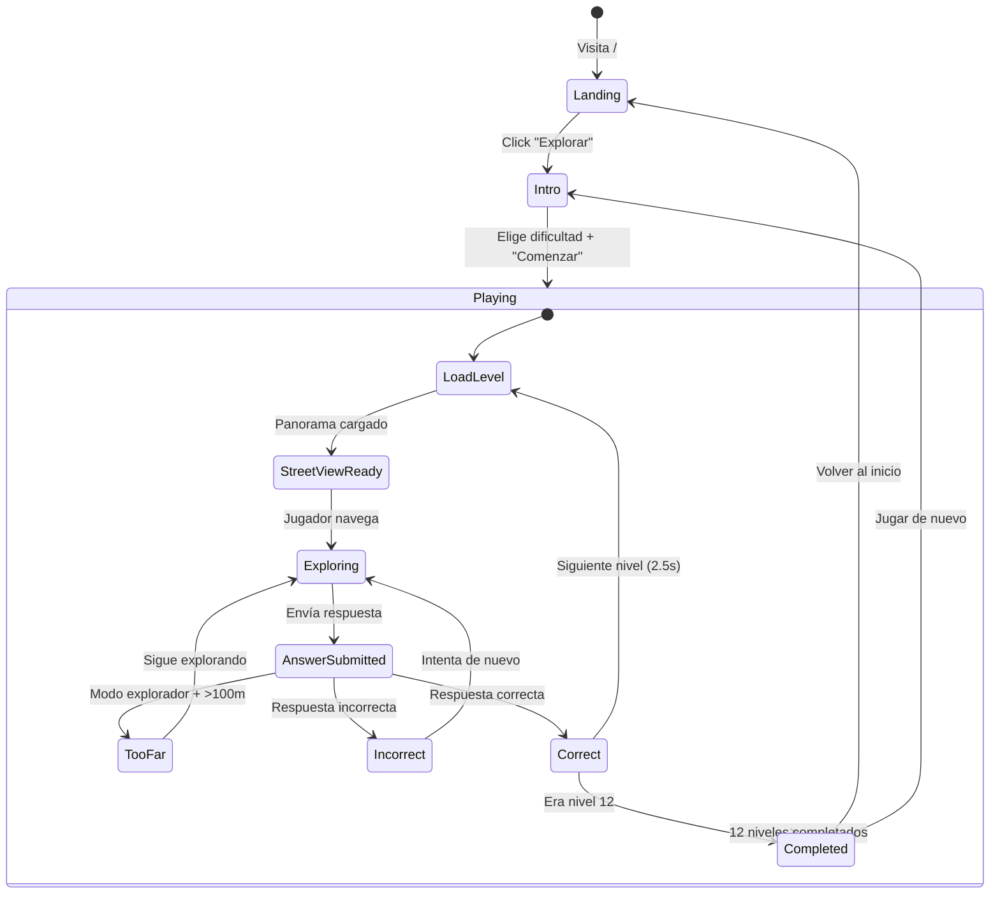

# Diseño del Juego — UBEX

> Documento de diseño completo para UBEX, la plataforma de geo-exploración donde los jugadores resuelven acertijos navegando calles reales a través de Google Street View.

---

## Tabla de Contenidos

1. [Concepto y Visión](#concepto-y-visión)
2. [Mecánicas de Juego](#mecánicas-de-juego)
3. [Sistema de Puntuación](#sistema-de-puntuación)
4. [Flujo del Jugador](#flujo-del-jugador)
5. [Modo Explorador — Proximidad](#modo-explorador--proximidad)
6. [Sistema de Pistas](#sistema-de-pistas)
7. [Tipos de Preguntas](#tipos-de-preguntas)
8. [Progresión de Dificultad](#progresión-de-dificultad)
9. [Diagrama de Estados del Juego](#diagrama-de-estados-del-juego)
10. [Demo Actual — Saga de Colón](#demo-actual--saga-de-colón)

---

## Concepto y Visión

**UBEX** (Urban Exploration) transforma las calles del mundo real en un campo de búsqueda del tesoro. Los jugadores no solo contestan preguntas: *exploran*. Usando Google Street View como motor de inmersión, cada saga lleva al jugador a caminar virtualmente por una ciudad real, descubriendo su historia, arquitectura y secretos ocultos.

### Propuesta de Valor

- **Para jugadores**: Una experiencia de exploración única que combina la emoción de una búsqueda del tesoro con el aprendizaje cultural
- **Para creadores de mapas**: Una plataforma para diseñar experiencias interactivas en sus ciudades favoritas
- **Para la comunidad**: Competencia en tiempo real con premios reales ($1,000 USD por saga premium)

### Principios de Diseño

| Principio | Descripción |
|-----------|-------------|
| **Exploración primero** | El jugador debe moverse por Street View para encontrar respuestas — no es un quiz estático |
| **Accesible pero profundo** | Fácil de empezar (modo Libre), difícil de dominar (modo Explorador + dificultad extrema) |
| **Cultural y educativo** | Cada saga enseña algo real sobre la ciudad: historia, arquitectura, cultura |
| **Competitivo y social** | Clasificaciones en tiempo real, conteo de participantes activos, premios reales |
| **Justo y verificable** | Validación server-side de respuestas, distancia calculada con Haversine, anti-trampas |

---

## Mecánicas de Juego

### Sagas

Una **saga** es la unidad principal de contenido. Cada saga es una colección temática de 12 niveles ambientados en una ciudad o zona geográfica específica.

| Campo | Descripción | Ejemplo |
|-------|-------------|---------|
| `id` | Identificador único | `saga-colon-2026` |
| `title` | Nombre de la saga | `Saga de Colón` |
| `subtitle` | Ciudad / zona | `Zona Colonial · Santo Domingo` |
| `description` | Descripción temática | Exploración histórica de la primera ciudad europea en América |
| `prize` | Premio al ganador | `$1,000 USD` |
| `totalLevels` | Siempre 12 | `12` |
| `maxParticipants` | Límite de jugadores | `5000` |
| `status` | Estado actual | `draft`, `scheduled`, `active`, `completed` |
| `startsAt` | Fecha/hora de inicio | ISO 8601 timestamp |

### Niveles

Cada saga contiene exactamente **12 niveles** que el jugador debe completar en orden secuencial. Un nivel define:

```
┌─────────────────────────────────────────────────────┐
│                     NIVEL                            │
├─────────────────────────────────────────────────────┤
│  Spawn Point (lat, lng, heading, pitch)             │
│  → Donde aparece el jugador en Street View          │
│                                                      │
│  Target Point (targetLat, targetLng)                │
│  → Ubicación de la respuesta correcta               │
│                                                      │
│  Acertijo (clue.text)                               │
│  → Pista que guía al jugador                        │
│                                                      │
│  Pista Opcional (clue.hint)                         │
│  → Ayuda adicional con penalización                 │
│                                                      │
│  Respuestas Correctas (correctAnswers[])            │
│  → Lista de respuestas aceptadas (aliases)          │
│                                                      │
│  Explicación (explanation)                          │
│  → Contexto educativo mostrado al acertar           │
│                                                      │
│  Dificultad (clue.difficulty)                       │
│  → easy | medium | hard | extreme                   │
└─────────────────────────────────────────────────────┘
```

### Modos de Dificultad

El jugador elige su modo de dificultad al inicio de la saga. Este afecta cómo puede interactuar con el juego:

#### Modo Libre (`libre`)

- El jugador puede responder desde **cualquier posición** en Street View
- Ideal para principiantes o jugadores que prefieren una experiencia relajada
- Puntuación base más baja

#### Modo Explorador (`explorador`)

- El jugador **debe estar dentro de 100 metros** de las coordenadas objetivo para poder enviar su respuesta
- Si está fuera del radio, el botón de envío se bloquea y aparece el mensaje "Acércate más al objetivo"
- Requiere exploración real del mapa
- Puntuación base más alta (multiplicador)
- Indicador visual de proximidad en la interfaz

```
                    ┌───────────────┐
                    │ Target Point  │
                    │  (lat, lng)   │
                    └───────┬───────┘
                            │
                     100m radius
                    ┌───────┴───────┐
                   ╱                 ╲
                  ╱   ✅ Zona de      ╲
                 │   Respuesta         │
                 │                     │
                  ╲   (puede enviar)  ╱
                   ╲                 ╱
                    └───────────────┘
                            │
               Fuera del radio = ❌ bloqueado
```

---

## Sistema de Puntuación

### Puntuación por Nivel

La puntuación de cada nivel se calcula considerando múltiples factores:

| Factor | Descripción | Impacto |
|--------|-------------|---------|
| **Tiempo** | Segundos desde que el nivel inició hasta respuesta correcta | Menos tiempo = más puntos |
| **Modo de dificultad** | Libre vs Explorador | Explorador otorga multiplicador |
| **Uso de pista** | Si el jugador reveló la pista | Penalización en puntuación |
| **Dificultad del nivel** | easy / medium / hard / extreme | Niveles más difíciles dan más puntos base |

### Fórmula de Puntuación (Diseño Planificado)

```
puntos_base = dificultad_nivel × 100
    easy    = 100
    medium  = 200
    hard    = 300
    extreme = 400

multiplicador_modo:
    libre      = 1.0×
    explorador = 1.5×

penalización_pista = -25% si se usó la pista

bonus_tiempo = max(0, 300 - segundos_transcurridos)

PUNTUACIÓN_NIVEL = (puntos_base × multiplicador_modo × penalización_pista) + bonus_tiempo
```

### Puntuación Total de la Saga

```
PUNTUACIÓN_SAGA = Σ (puntuación de cada nivel completado)
```

### Clasificación (Leaderboard)

El ganador se determina por:
1. **Primer criterio**: Primer jugador en completar los 12 niveles
2. **Segundo criterio**: Mayor puntuación total (en caso de empate por tiempo)
3. **Tercer criterio**: Menor uso de pistas

---

## Flujo del Jugador

### Flujo Completo: Registro → Resultado

```
┌──────────┐    ┌──────────┐    ┌──────────┐    ┌──────────┐
│ Landing  │───▶│ Registro │───▶│ Selección│───▶│ Countdown│
│ Page     │    │ / Login  │    │ de Saga  │    │ Timer    │
└──────────┘    └──────────┘    └──────────┘    └────┬─────┘
                                                      │
                                                      ▼
┌──────────┐    ┌──────────┐    ┌──────────┐    ┌──────────┐
│ Resultado│◀───│ Nivel 12 │◀───│  ...     │◀───│ Nivel 1  │
│ Final    │    │          │    │          │    │ (intro)  │
└──────────┘    └──────────┘    └──────────┘    └──────────┘
```

### Detalle del Flujo por Fase

#### 1. Landing Page (`/`)
- El jugador ve el hero con la próxima saga disponible
- Cuenta regresiva hasta el inicio de la saga
- Información sobre el premio, mecánicas y participantes
- CTA: "Explorar ahora" → `/play`

#### 2. Pantalla de Introducción (Intro)
- Se muestra información de la saga: título, subtítulo, premio
- El jugador elige modo de dificultad: **Libre** o **Explorador**
- Descripción de las reglas de cada modo
- Botón "Comenzar Exploración" inicia el juego

#### 3. Gameplay (12 Niveles)
Para cada nivel:
1. Street View carga en las coordenadas de spawn del nivel
2. El acertijo aparece en el `ClueCard`
3. El jugador navega libremente por Street View
4. Opcionalmente revela la pista (con penalización)
5. Escribe su respuesta en el campo de texto
6. En modo Explorador: debe estar a ≤100m del objetivo
7. Al enviar:
   - **Correcto** → Overlay verde → Avanza al siguiente nivel (2.5s delay)
   - **Incorrecto** → Shake del input → Puede intentar de nuevo
   - **Muy lejos** (modo Explorador) → Mensaje "Acércate más"

#### 4. Pantalla de Ganador
- Se muestra al completar el nivel 12
- Tiempo total de la saga
- Invitación a volver a jugar o regresar al inicio

---

## Modo Explorador — Proximidad

### Fórmula de Haversine

La distancia entre la posición del jugador y el objetivo se calcula con la fórmula de Haversine, que determina la distancia del gran círculo entre dos puntos en una esfera:

```
Radio de la Tierra (R) = 6,371,000 metros

Dados:
  - Posición del jugador: (lat₁, lng₁)
  - Posición del objetivo: (lat₂, lng₂)

Cálculo:
  φ₁ = lat₁ × π / 180
  φ₂ = lat₂ × π / 180
  Δφ = (lat₂ - lat₁) × π / 180
  Δλ = (lng₂ - lng₁) × π / 180

  a = sin²(Δφ/2) + cos(φ₁) × cos(φ₂) × sin²(Δλ/2)
  c = 2 × atan2(√a, √(1-a))

  distancia = R × c  (en metros)
```

### Implementación en el Código

Referencia: `src/app/play/page.tsx` → función `haversineMeters()`

```typescript
function haversineMeters(lat1: number, lng1: number, lat2: number, lng2: number): number {
  const R = 6_371_000; // Radio de la Tierra en metros
  const toRad = (deg: number) => (deg * Math.PI) / 180;
  const dLat = toRad(lat2 - lat1);
  const dLng = toRad(lng2 - lng1);
  const a =
    Math.sin(dLat / 2) ** 2 +
    Math.cos(toRad(lat1)) * Math.cos(toRad(lat2)) * Math.sin(dLng / 2) ** 2;
  return R * 2 * Math.atan2(Math.sqrt(a), Math.sqrt(1 - a));
}
```

### Constantes de Proximidad

| Constante | Valor | Ubicación |
|-----------|-------|-----------|
| `PROXIMITY_RADIUS_M` | `100` metros | `src/app/play/page.tsx` |
| Radio de búsqueda de Street View | `200` metros | `src/components/maps/StreetViewExplorer.tsx` |

### Flujo de Validación de Proximidad

```
Jugador envía respuesta
        │
        ▼
¿Modo = explorador?
   │          │
   No         Sí
   │          │
   ▼          ▼
Validar    Calcular distancia
respuesta  (Haversine)
              │
              ▼
         ¿distancia ≤ 100m?
            │          │
            Sí         No
            │          │
            ▼          ▼
         Validar    Feedback:
         respuesta  "Acércate más
                     al objetivo"
```

---

## Sistema de Pistas

### Funcionamiento

Cada nivel puede incluir una **pista opcional** (`clue.hint`) que proporciona información adicional para resolver el acertijo.

| Aspecto | Detalle |
|---------|---------|
| **Estado inicial** | Oculta — el jugador ve un botón "Revelar Pista" |
| **Acción** | Al hacer clic, la pista se muestra permanentemente para ese nivel |
| **Penalización** | Reducción del 25% en la puntuación del nivel |
| **Irreversible** | Una vez revelada, no se puede ocultar ni deshacer la penalización |
| **Componente** | `ClueCard` → botón con icono `Lightbulb` |

### Ejemplo de Pista

**Acertijo**: *"En la primera calle europea del Nuevo Mundo, las piedras guardan 500 años de secretos. ¿Cómo se llama esta calle histórica?"*

**Pista**: *"Es conocida como la calle de las Damas, nombrada así porque las esposas de los colonizadores españoles solían pasear por ella."*

**Respuesta**: `Calle Las Damas`

---

## Tipos de Preguntas

Las preguntas están diseñadas para requerir observación real del entorno en Street View, no simplemente conocimiento previo. Los tipos principales son:

### 1. Observación Directa
El jugador debe encontrar y leer algo visible en Street View.

> *"¿Cuántos arcos tiene la fachada del Alcázar de Colón?"*
> **Respuesta**: `5`

### 2. Historia y Cultura
Requiere encontrar un lugar y conectar información histórica.

> *"En el panteón nacional, una llama nunca se apaga. ¿Qué tipo de monumento ilumina el descanso eterno de los héroes?"*
> **Respuesta**: `lámpara` / `llama eterna`

### 3. Conteo y Detalle
El jugador debe contar elementos arquitectónicos u objetos.

> *"¿Cuántos arcos tiene la fachada del palacio del virrey?"*
> **Respuesta**: `5`

### 4. Orientación y Navegación
Requiere llegar a un punto específico siguiendo pistas direccionales.

> *"Camina por la calle peatonal más famosa de la Zona Colonial, donde los artistas y vendedores crean un mosaico de color..."*
> **Respuesta**: `El Conde`

### 5. Identificación Arquitectónica
Reconocer estilos, materiales o elementos constructivos.

> *"La catedral fue construida con un estilo que mezcla el gótico tardío con algo más ornamental. ¿Qué estilo arquitectónico renacentista define su fachada?"*
> **Respuesta**: `plateresco`

### 6. Fechas y Datos Históricos
Conectar un lugar con un hecho cronológico.

> *"Al cruzar esta puerta, los dominicanos declararon su independencia. ¿En qué año ocurrió?"*
> **Respuesta**: `1844`

---

## Progresión de Dificultad

Los 12 niveles de cada saga siguen una curva de dificultad creciente:

```
Dificultad
    ▲
    │
 E  │                                          ████
 x  │                                     ████
 t  │                                ████
 r  │
 e  │
 m  │
 e  │
    │
 H  │                           ████
 a  │                      ████
 r  │                 ████
 d  │
    │
 M  │            ████
 e  │       ████
 d  │  ████
    │
 E  │
 a  ████
 s  ████
 y  │
    └──────────────────────────────────────────────▶
      1    2    3    4    5    6    7    8    9   10  11  12
                         Nivel
```

### Distribución por Nivel

| Niveles | Dificultad | Características |
|---------|-----------|-----------------|
| 1–3 | `easy` | Respuestas visibles directamente, spawn cerca del objetivo, pistas generosas |
| 4–6 | `medium` | Requieren algo de exploración, pistas menos directas, respuestas menos obvias |
| 7–9 | `hard` | Spawn lejos del objetivo, acertijos complejos, múltiples pasos de navegación |
| 10–12 | `extreme` | Acertijos crípticos, spawn muy lejos, requieren conocimiento + observación + navegación |

### Ejemplo de la Saga de Colón (Demo)

| Nivel | Título | Dificultad | Tipo de Pregunta |
|-------|--------|-----------|------------------|
| 1 | El Descubridor | `easy` | Identificación (estatua) |
| 2 | La Primera Calle | `easy` | Orientación (nombre de calle) |
| 3 | El Palacio del Virrey | `easy` | Conteo (arcos) |
| 4 | La Primada de América | `medium` | Arquitectura (estilo) |
| 5 | La Fortaleza | `medium` | Identificación (torre) |
| 6 | El Panteón | `medium` | Observación (monumento) |
| 7 | El Paseo Peatonal | `hard` | Orientación (calle) |
| 8 | Las Casas del Rey | `hard` | Observación (objeto) |
| 9 | Las Ruinas Sagradas | `hard` | Historia (orden religiosa) |
| 10 | La Puerta de la Independencia | `extreme` | Fecha histórica |
| 11 | La Plaza del Almirante | `extreme` | Material (composición) |
| 12 | El Tesoro Final | `extreme` | Fecha histórica (fundación) |

---

## Diagrama de Estados del Juego

### Estados Principales



### Diagrama ASCII Detallado

```
┌─────────────────────────────────────────────────────────────────────────┐
│                        FLUJO DE ESTADOS DEL JUEGO                       │
└─────────────────────────────────────────────────────────────────────────┘

    ┌─────────┐
    │ LANDING │  (/)
    │  PAGE   │  Countdown timer, stats, CTA
    └────┬────┘
         │ Click "Explorar ahora"
         ▼
    ┌─────────┐
    │  INTRO  │  Selección de saga
    │ SCREEN  │  Selección de dificultad (libre / explorador)
    └────┬────┘
         │ Click "Comenzar Exploración"
         ▼
    ┌─────────────────────────────────────────────────────────────┐
    │                     PLAYING (Nivel N)                        │
    │                                                              │
    │  ┌──────────────┐                                           │
    │  │ LOAD LEVEL   │ Cargar spawn point en Street View         │
    │  │              │ Buscar panorama (200m radio, NEAREST)     │
    │  └──────┬───────┘                                           │
    │         │ Panorama encontrado                                │
    │         ▼                                                    │
    │  ┌──────────────┐                                           │
    │  │  EXPLORING   │ Jugador navega Street View                │
    │  │              │ Lee acertijo en ClueCard                  │
    │  │              │ (Opcional) Revela pista                   │
    │  │              │ Monitorea posición (onPositionChange)     │
    │  └──────┬───────┘                                           │
    │         │ Envía respuesta                                    │
    │         ▼                                                    │
    │  ┌──────────────┐     ┌─────────────┐                      │
    │  │  VALIDATING  │────▶│  TOO FAR    │ (solo modo explorador)│
    │  │  (600ms)     │     │  "Acércate  │ distancia > 100m     │
    │  │              │     │   más"       │──────────┐           │
    │  └──────┬───────┘     └─────────────┘          │           │
    │         │                                        │           │
    │    ┌────┴────┐                                   │           │
    │    │         │                                   │           │
    │    ▼         ▼                                   │           │
    │ ┌──────┐ ┌──────────┐                           │           │
    │ │ ✅   │ │ ❌       │                           │           │
    │ │CORREC│ │INCORRECT │ Shake input               │           │
    │ │ TO   │ │          │ Clear feedback (2s)        │           │
    │ └──┬───┘ └─────┬────┘                           │           │
    │    │           │                                 │           │
    │    │           └────────────────┬────────────────┘           │
    │    │                           │                             │
    │    │                           ▼                             │
    │    │                    Volver a EXPLORING                   │
    │    │                                                         │
    │    ├───── ¿Nivel < 12? ──── Sí ──▶ LOAD LEVEL (N+1)       │
    │    │                                 (delay 2500ms)         │
    │    │                                                         │
    │    └───── ¿Nivel = 12? ──── Sí ──▶ EXIT PLAYING            │
    │                                                              │
    └─────────────────────────────────────────────────────────────┘
         │
         ▼
    ┌─────────┐
    │COMPLETED│  Pantalla de ganador
    │ (WINNER)│  Tiempo total, puntuación
    └────┬────┘
         │
    ┌────┴────┐
    │         │
    ▼         ▼
  Home    Jugar de
  (/)     nuevo
```

### Estados de la Sesión de Juego (Backend)

```
┌──────────┐    ┌───────────┐    ┌──────────┐    ┌───────────┐
│ waiting  │───▶│ countdown │───▶│ playing  │───▶│ completed │
│          │    │           │    │          │    │           │
│ Jugadores│    │ Timer     │    │ Niveles  │    │ Ganador   │
│ se unen  │    │ activo    │    │ activos  │    │ definido  │
└──────────┘    └───────────┘    └──────────┘    └───────────┘
```

---

## Demo Actual — Saga de Colón

La versión actual del juego incluye una saga demo completamente jugable:

### Datos de la Saga

- **ID**: `saga-colon-2026`
- **Título**: Saga de Colón
- **Ubicación**: Zona Colonial, Santo Domingo, República Dominicana
- **Premio**: $1,000 USD (demo)
- **Participantes máximos**: 5,000

### Validación de Respuestas (Demo)

En la versión demo, la validación es **client-side** con fuzzy matching:

```
Respuesta del jugador
        │
        ▼
    normalize()
        │ trim → lowercase → quitar acentos → quitar puntuación → colapsar espacios
        ▼
    ¿Algún correctAnswer[] contiene la respuesta normalizada?
        │           │
        Sí          No
        │           │
        ▼           ▼
    ✅ Correcto   ❌ Incorrecto
```

**Función `normalize()`**: Convierte la entrada a minúsculas, elimina acentos (NFD + strip diacritics), remueve puntuación, y colapsa espacios múltiples.

**Matching**: Usa `includes()` — si la respuesta normalizada del jugador es un **substring** de cualquier respuesta correcta, o viceversa, se acepta como correcta.

> **Nota**: En producción, la validación será **server-side** con Supabase + opcionalmente Gemini AI para mayor flexibilidad semántica.

### Participantes Simulados (Demo)

La versión demo simula participantes activos para crear sensación de competencia:

```
participantes_base = 4,832
drop_por_nivel = 380
jitter = random(-50, +50)

participantes_activos = max(200, base - (nivel × drop) + jitter)
```

Se actualiza cada 3 segundos con pequeñas variaciones aleatorias.

---

## Futuras Mecánicas (Roadmap)

### Power-Ups (Planificados)

| Power-Up | Tipo | Efecto |
|----------|------|--------|
| Lupa (`magnifying_glass`) | Consumible | Reduce el área de búsqueda |
| Brújula (`compass`) | Consumible | Indica dirección al objetivo |
| Congelador de Tiempo (`time_freeze`) | Consumible | Pausa el cronómetro por 30s |

### Equipos (Planificado)

- Formación de equipos para sagas colaborativas
- Tabla definida en schema: `teams`

### Monetización

- **Tipos de suscripción**: `single`, `triple`, `six_pack`, `saga_complete`
- **Integración de pagos**: PayPal (ya incluido en dependencias), Google Pay (planificado)
